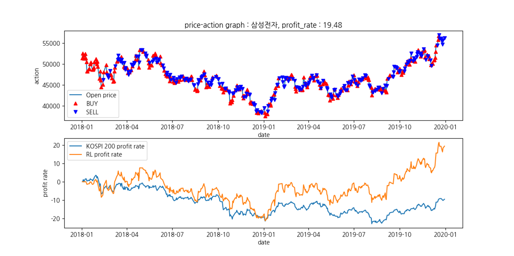
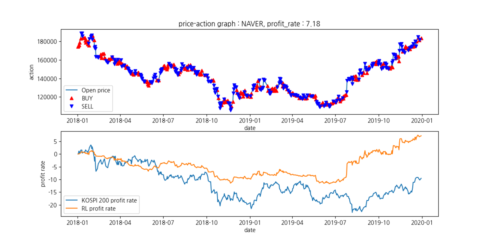

# 쌍 스프레드와 모방 강화학습을 이용한 트레이딩 알고리즘
(https://www.dbpia.co.kr/journal/articleDetail?nodeId=NODE11048088)

## introduction
본 논문은 주식 쌍의 스프레드와 모방강화학습을 이용한 트레이딩 알고리즘을 제안한다. 시장중립성을 얻기 위해서 목표
주식과 공적분(cointegration) 관계에 있는 주식을 선별하여 두 주식간의 스프레드를 구하여 스테이트를 설정하고
MDPP(Minimum Distance Principle Percentage) 알고리즘에 의한 매매 결정을 강화학습으로 모방함으로써 트레이딩하는
알고리즘을 제안하였다. 실험을 통해 제안된 방법이 KOSPI200 지수에 대한 수익률보다 높음을 보여주었다.

## Related work
Perng, C. S., Wang, H., Zhang, S. R., & Parker, D. S. (2000,
February). Landmarks: a new model for similarity-based pattern
querying in time series databases. In Proceedings of 16th
International Conference on Data Engineering (Cat. No. 00CB37073)
(pp. 33-42). IEEE.
(https://ieeexplore.ieee.org/document/839385)

Hester, T., Vecerik, M., Pietquin, O., Lanctot, M., Schaul, T., Piot,
B., ... & Gruslys, A. (2018, April). Deep q-learning from
demonstrations. In Thirty-second AAAI conference on artificial
intelligence.
(https://arxiv.org/abs/1704.03732)

## Result
본 논문에서는 2006년 1월 2일부터 2017년 12월 29일까지 KOSPI200에
속한 여러 종목의 데이터를 분석하여 삼성전자, NAVER와 공적분 관계에
있는 주식 쌍을 찾아 모방강화학습을 이용하여 학습한 후 목표 주식을
2018년 1월 2일부터 2019년 12월 30일까지 트레이딩하여 동일한 기간의 KOSPI 200 지수의 수익률보다 안정적이고 높은 수익률을
내었으며 트레이딩한 지점과 수익률 변화를 나타내고 있다.

